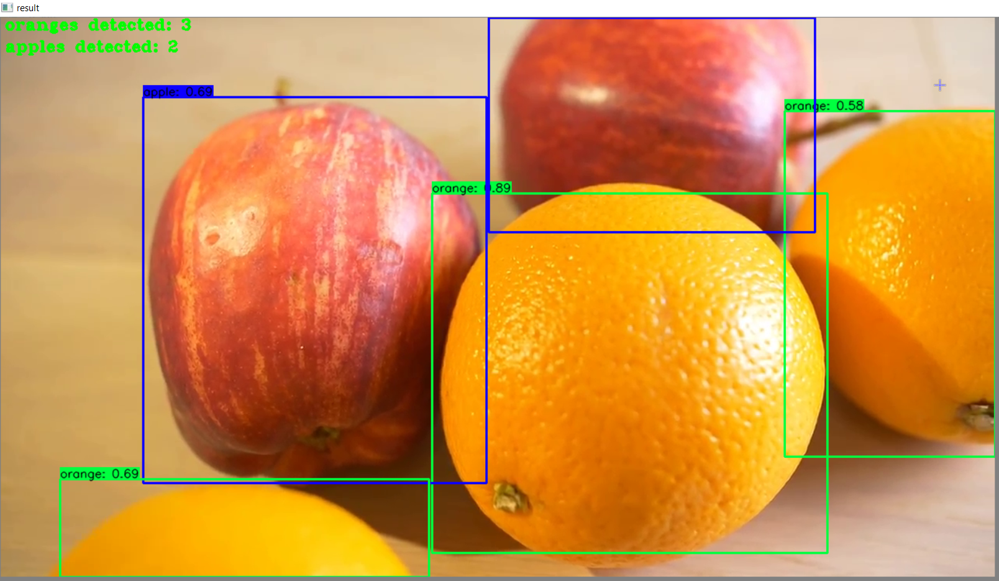
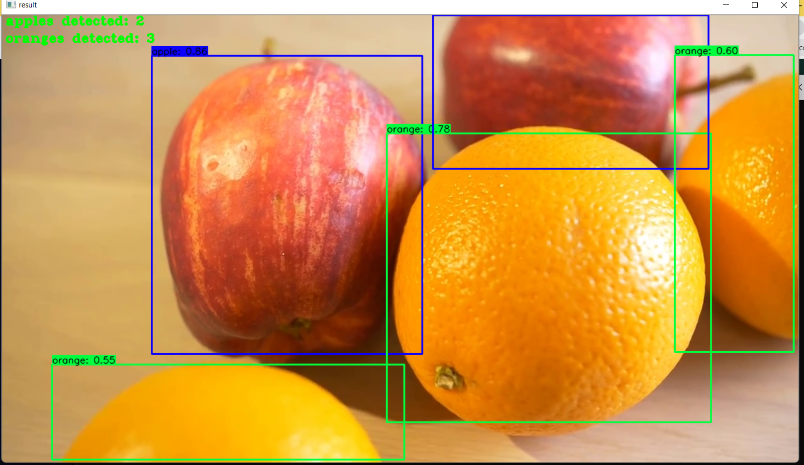

# yolov4-custom-functions
## Getting Started
### Conda (Recommended)


# Tensorflow GPU
conda env create -f conda-gpu.yml ,
conda activate yolov4-gpu


## Downloading Official Pre-trained Weights
YOLOv4 comes pre-trained and able to detect 80 classes. For easy demo purposes we will use the pre-trained weights.
Download pre-trained yolov4.weights file: https://drive.google.com/open?id=1cewMfusmPjYWbrnuJRuKhPMwRe_b9PaT

Copy and paste yolov4.weights from your downloads folder into the 'data' folder of this repository.

If you want to use yolov4-tiny.weights, a smaller model that is faster at running detections but less accurate, download file here: https://github.com/AlexeyAB/darknet/releases/download/darknet_yolo_v4_pre/yolov4-tiny.weights


## YOLOv4 Using Tensorflow (tf, .pb model)
To implement YOLOv4 using TensorFlow, first we convert the .weights into the corresponding TensorFlow model files and then run the model.

# Convert darknet weights to tensorflow
# yolov4-tiny
python save_model.py --weights ./data/yolov4-tiny.weights --output ./checkpoints/yolov4-tiny-416 --input_size 416 --model yolov4 --tiny


# Run yolov4 on video
python detect_video.py --weights ./checkpoints/yolov4-416 --size 416 --model yolov4 --video ./data/video/apple.mp4 --output ./detections/results.avi


# Count the number of apples and oranges in a video
python detect_video.py --weights ./checkpoints/yolov4-416 --size 416 --model yolov4 --video ./data/video/apple.mp4 --count

### Result Video
Video saves wherever you point --output flag to. If you don't set the flag then your video will not be saved with detections on it.
<p align="center"></p>
<p align="center"></p>


## Command Line Args Reference

```bash
save_model.py:
  --weights: path to weights file
    (default: './data/yolov4.weights')
  --output: path to output
    (default: './checkpoints/yolov4-416')
  --[no]tiny: yolov4 or yolov4-tiny
    (default: 'False')
  --input_size: define input size of export model
    (default: 416)
  --framework: what framework to use (tf, trt, tflite)
    (default: tf)
  --model: yolov3 or yolov4
    (default: yolov4)


detect_video.py:
  --video: path to input video (use 0 for webcam)
    (default: './data/video/video.mp4')
  --output: path to output video (remember to set right codec for given format. e.g. XVID for .avi)
    (default: None)
  --output_format: codec used in VideoWriter when saving video to file
    (default: 'XVID)
  --[no]tiny: yolov4 or yolov4-tiny
    (default: 'false')
  --weights: path to weights file
    (default: './checkpoints/yolov4-416')
  --framework: what framework to use (tf, trt, tflite)
    (default: tf)
  --model: yolov3 or yolov4
    (default: yolov4)
  --size: resize images to
    (default: 416)
  --iou: iou threshold
    (default: 0.45)
  --score: confidence threshold
    (default: 0.25)
  --count: count objects within video
    (default: False)
  --dont_show: dont show video output
    (default: False)
  --info: print info on detections
    (default: False)
  --crop: crop detections and save as new images
    (default: False)
```

### References  

   Huge shoutout goes to hunglc007 for creating the backbone of this repository:
  * [tensorflow-yolov4-tflite](https://github.com/hunglc007/tensorflow-yolov4-tflite)
  * https://github.com/theAIGuysCode
